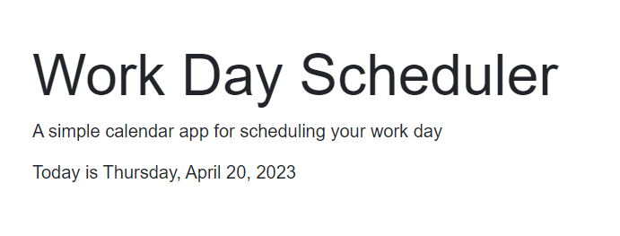

# 05-Workday-Planner

## Description

This project was created to further develop my skills in JavaScript and using JQuery.
It is also a great webpage to schedule your work day.

## Installation

No Installation needed. Simply type in the URL below in your preferred browser to start scheduling your workday!

## Usage
 1. Visit URL provided
 2. Add your appointment or item to the appropriate time slot
 3. Click the floppy disk image to save input
 4. Time slots should be color coded depending on if the time slot is in the past, present or future.

 
 
 

## Credits
    -TA Jack : Helped create and debug time-block conditional statement
    -Tutor Jili Jiang: Helped debug code and create getItem code

## License
    Please see repository for more information on the license
